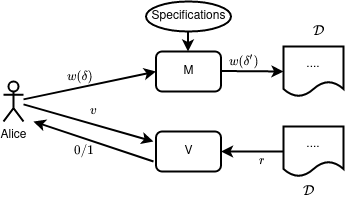
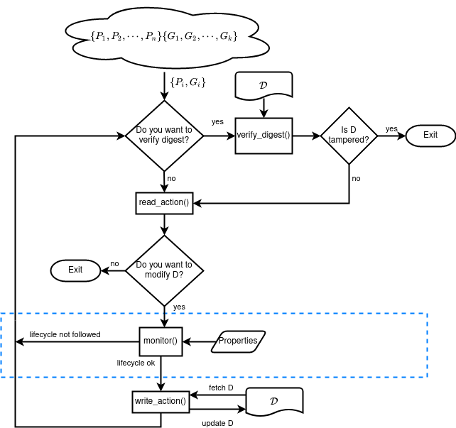
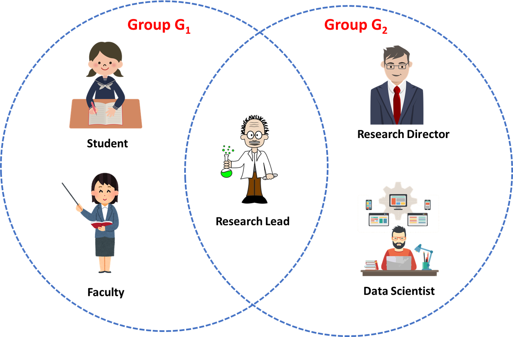

# Towards a Secure Framework for Artifact-centric Workflows Leveraging Runtime Enforcement


This framework can be divided into two sections:
*   Preserving Integrity-Privacy constraints.
*   Enforcing lifecycle constraints.



We specify the necessary lifecycle constraints as specification and construct an enforcement monitor out of them, which will prevent any unauthorised changes into the document, assuring the system’s safety.

## Requirements:
*   Python 3.x
*   Go (installation steps mentioned in [execution](#execution-steps) section)
*   rsa library *pip3 install rsa*
*   hashlib     
*   os


<!-- To run code:

```bash
    python3 main.py
``` -->
## Process Flow Diagram:



All the actions done by peers are mentioned in process flow diagram. 

## Implementation:

Implementation can also be divided into two components:
*   Implementaing cryptographic approaches
*   Implementing runtime enforcment approaches (inside dotted section).




To demonstrate our framework, we have considered a scenario. 

In this considered scenario, I have taken two groups and five peers. They are alloted groups where one peer can be part of more than one group.

>Groups
> * G1 (Group 1)
> * G2 (Group 2)

<table>
<tr>
<th> Peers </th>
<th> Groups Assigned </th>
</tr>
<tr>
<td> A (Student)</td>
<td> G1 </td>
</tr>
 <tr>
<td> B (Faculty)</td>
<td> G2 </td>
</tr>
 <tr>
<td> C (Research Lead)</td>
<td> G1, G2 </td>
</tr>
<tr>
 <tr>
<td> D (Data Scientist)</td>
<td> G2 </td>
</tr>
 <tr>
<td> E (Research Director)</td>
<td> G2 </td>
</tr>
</table>

Users will be performing actions (write) on a common shared document between all the users.

Users also need to mention through which group they are performing action.

If action is verified, required changes will be made in file and digest based on RSA, sha256, older digest and user private key will be added along with some details in the action sequence.

> If user won't have access to that group, he can't perform action.

In the last, I have also shown how any user can verify the file using action sequences and calculated digest.

This can be done by any user but actual action performed can only be read by members of that group.

## Lifecycle Constraints Considered:

We have taken 3 constraints for demonstrating applicability of our approach:

1.  A student can undertake a research project only after it is approved by the faculty and the research lead.

2.  Research director can initiate the funding process only after the data scientist has approved.

3.  Faculties can use data for experiments only after it has been prepared and released by the data scientist.

## Execution Steps:

We have implemented runtiem enforcer into *easy-rte-master* folder.

Lifecycle constraints are mentioned in .erte file at file [erte file](easy-rte-master/example/runtime_lifecycle_enforcer/runtime_lifecycle_enforcer.erte).

To understand how to write constraints using VDTA tool, you can visit [VDTA tool documentation](https://github.com/PRETgroup/easy-rte).

We will call required modules and functions from the created project file [runtime_lifecycle_enforcer_main.c](easy-rte-master/example/runtime_lifecycle_enforcer/runtime_lifecycle_enforcer_main.c)

> These steps are tested for Ubuntu20.04 LTS operating system. In case of other OS, please use alternatives of similar commands. 

1.  Change directory to */easy-rte-master*
    > cd easy-rte-master/

2.  Need this step for first time only. You need to download Go programming language to build few libraries. Follow [this link](https://go.dev/doc/install)  to install Go programming langauge. Now run make command.
    > make

2. Compile and build our project file for generating enforcement monitor based on our constraints specified.
    > make c_enf c_build  PROJECT=runtime_lifecycle_enforcer

3.  Run this genrated file. This will run our project and will run [lifecycle_main.py](lifecycle_main.py) file.
    > ./example_runtime_lifecycle_enforcer

All the actions in our document are taken from [action.txt](actions.txt) file. You can edit this file without any need for rebuilding project.

Actions on the document can be mentioned easily in the format.
>   &lt;peer_name&gt;, &lt;Group_name&gt;, &lt;write_action_text&gt; <br>
>   A, G1, hello World!!<br>
>   C, G2, I am Research Lead 

